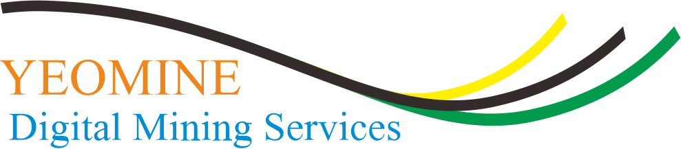

<h3 align="center">
    
</h3>

Yeomine is a product that is built by a web and desktop application using python language as backend and streamlit
as framework. This is integrated with computer vision technology using YoloV8 Model that is developed 
with thousands of actual and valid open coal mining data.

In Yeomine, there is a recommendation and prediction system that is very helpful in achieving coal extraction targets in open pit mines. 
This system or application can help maintain energy stability by optimizing the control of coal production.

These application can applied on the several object like:
1. 